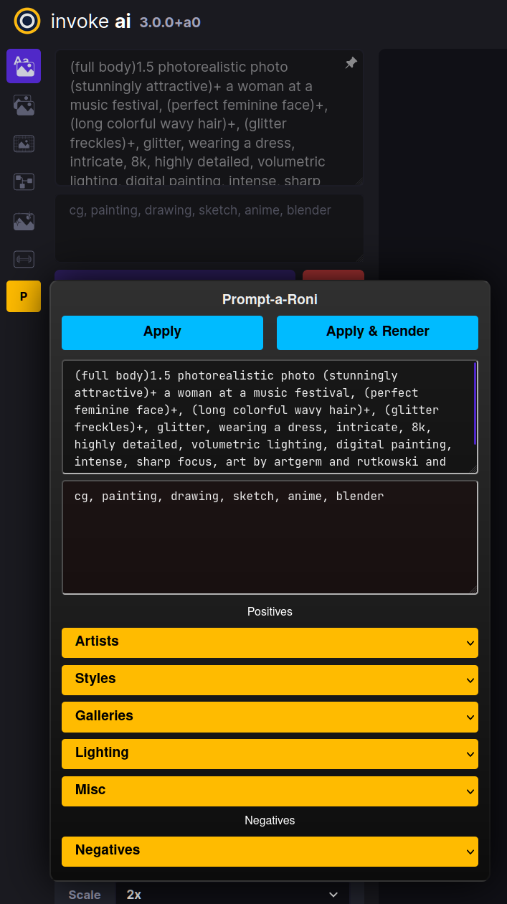

# Prompt-a-Roni for InvokeAI

## Summary

Prompt-a-Roni is a [Greasemonkey](https://addons.mozilla.org/en-US/firefox/addon/greasemonkey/) script for [InvokeAI](https://github.com/invoke-ai/InvokeAI) that provides a prompt toolbox.

- It is currently a work in progress.
- It has been tested on Firefox, but should work fine anywhere Greasemonkey is supported.
- Future updates to InvokeAI may break this script, but currently works as of the 3.x `main` branch.

## Installation

This is left as an exercise for the reader.

**The current compiled script is in `dist/build.js`.**

## What's it look like?

## Current Plans

- [ ] User snippets stored to localstorage
- [ ] Add syntax expansions
  - [ ] random selections (e.g. [a|b|c])
  - [ ] random colors (e.g. $COLOR)
- [ ] Add clipboard copy that combines positive and negative prompts in one step
- [ ] Strength incrementor? (automate + generate bumping a prompt fragment up in strength, e.g. "(word)1.0 -> word(1.1) -> etc", while auto-rendering at each interval")

## Why did you name it this?

Literally the first thing that popped into my head. And I was hungry, probably.
