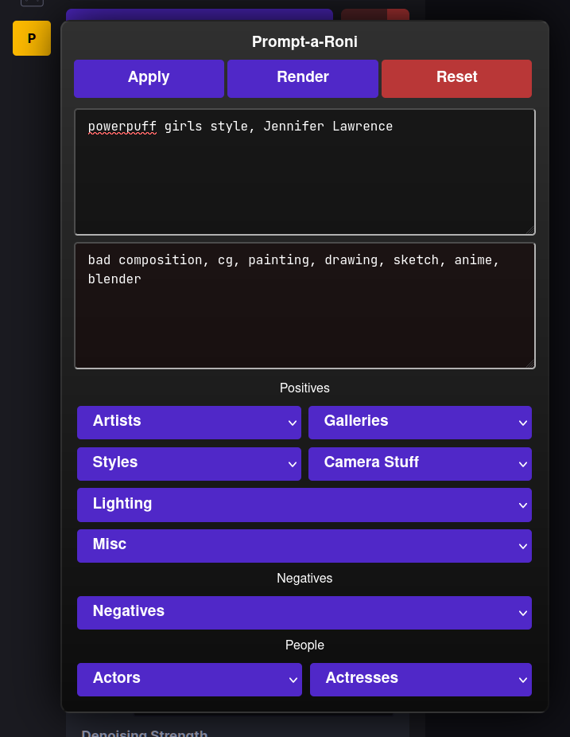

# Prompt-a-Roni for InvokeAI

## Summary

Prompt-a-Roni is a [Greasemonkey](https://addons.mozilla.org/en-US/firefox/addon/greasemonkey/) script for [InvokeAI](https://github.com/invoke-ai/InvokeAI) that provides a prompt toolbox.

- It is currently a work in progress.
- It has been tested on Firefox, but should work fine anywhere Greasemonkey is supported.
- Future updates to InvokeAI may break this script, but currently works as of the 3.x `main` branch.

## What's it look like?

## Current Plans

- [ ] User snippets stored to localstorage
